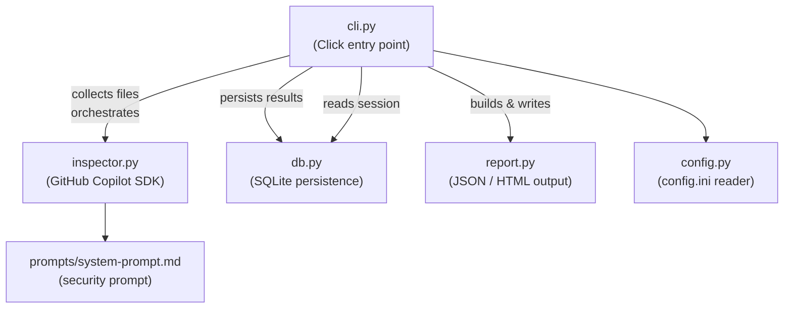

# vulguard 1.0.2

[](LICENSE)
[](CHANGELOG.md)

> A lightweight CLI security tool that automatically scans source code for vulnerabilities, highlights risky patterns, and guides developers toward safer implementations to strengthen their applications' overall security posture.

## Prerequisites

- Python `>=3.14`
- An active [GitHub Copilot](https://github.com/features/copilot) subscription (used for AI-powered inspection)

## Installation

```bash
pip install vulguard
```

## Usage

```bash
vulguard [OPTIONS] COMMAND [ARGS]...
```

### `inspect` — Scan files or directories

```bash
vulguard inspect [OPTIONS] PATHS...
```

| Option | Default | Description |
|---|---|---|
| `PATHS` | *(required)* | One or more files or directories to scan (recursive). |
| `--ext TEXT` | *(all files)* | Comma-separated extensions to inspect, e.g. `py,js,ts`. |
| `--output-dir PATH` | `<cwd>/reports` | Directory where reports are written. |
| `--report TEXT` | `vulguard-report` | Base filename for the report (no extension appended). |
| `--format [json\|html]` | `json` | Report format. Selecting `html` also produces a JSON file. |
| `--db-dir PATH` | `~/.vulguard` | Directory for the SQLite session database. |

#### Examples

```bash
# Scan all Python files in src/ and write a JSON report to ./reports
vulguard inspect src/ --ext py

# Scan multiple paths and produce an HTML report
vulguard inspect src/ tests/ --ext py,js --format html --output-dir reports

# Use a custom report name and database directory
vulguard inspect src/ --report my-scan --db-dir /tmp/vg-db
```

## Configuration

On first run, vulguard bootstraps a configuration directory and copies its default `config.ini` and `logging.ini` there. You can override the location with the `VULGUARD_CONFIG_DIR` environment variable:

```bash
# Windows (PowerShell)
$env:VULGUARD_CONFIG_DIR = "C:\Users\you\.vulguard"

# macOS / Linux
export VULGUARD_CONFIG_DIR="$HOME/.vulguard"
```

### `config.ini` settings

| Section | Key | Default | Description |
|---|---|---|---|
| `model` | `model` | `claude-sonnet-4.6` | GitHub Copilot model used for inspection. |
| `model` | `timeout` | `300` | Per-file inspection timeout in seconds. |
| `retry` | `max-attempts` | `5` | Maximum number of retry attempts on transient errors. |
| `retry` | `base-delay` | `0.5` | Initial back-off delay in seconds. |
| `retry` | `max-delay` | `10.0` | Maximum back-off delay in seconds. |

## Development

### Prerequisites

- Poetry `2.2+`

### Architecture



### Setup

```bash
poetry install
```

### Format and Lint

```bash
poetry run black vulguard; poetry run pylint vulguard
```

Pylint must score **10.00/10** before committing.

### Run Tests

```bash
poetry run pytest --cov=vulguard tests --cov-report html
```

Maintain **≥80 %** coverage.

### Fixture-based integration smoke test

```bash
poetry run vulguard inspect tests/fixtures --ext py --format html
```

## Publishing to PyPI

### Prerequisites

- A [PyPI](https://pypi.org/) account with an API token.

### Configure the token

```bash
poetry config pypi-token.pypi <your-token>
```

### Build and publish

```bash
poetry publish --build
```

This builds the source distribution and wheel, then uploads them to PyPI in one step.

> **Note:** PyPI releases are immutable. Once a version is published, it cannot be overwritten.  
> To fix a mistake, yank the release via the PyPI web UI and publish a new version.

## [Changelog](CHANGELOG.md)

See [CHANGELOG.md](CHANGELOG.md) for the full release history.

## License

This project is licensed under the [MIT License](LICENSE).

## Author

Ron Webb
